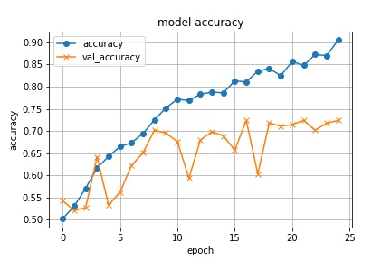
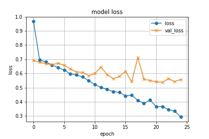

# 畳み込みニューラルネットワーク

## 実行環境
Python 3.7

### 追加パッケージ
* requests==2.22.0
* beautifulsoup4==4.8.2
* opencv-python==4.1.2.30
* numpy==1.18.1
* tensorflow==1.15.0
* Keras==2.3.1
* matplotlib==3.1.1

## 説明
CNNを用いて犬と猫の画像を学習するプログラムです。
4つのソースコードを実行することで画像の取得、処理、判別を行います。

### CNNの仕組み
CNN(畳み込みニューラルネットワーク)とはニューラルネットワークのアルゴリズムの一種で、ネットワーク内部に「たたみ込み層」と「プーリング層」を持つ特徴があります。  
ニューラルネットワークは脳内の神経細胞とそのつながりを数式的なモデルで表現したもので、深層学習として使用するケースが増えています。  
CNNではニューラルネットワークを多層にして用いることで、画像のデータ処理の精度を向上させることができます。
### scrape.py
google検索により犬と猫の画像を集めてきます。  
Originalフォルダにそれぞれ800枚程度保存されます。
### image_resizer.py
画像のサイズを変更します。  
Editedフォルダに250×250にリサイズされた画像が保存されます。
### image_sprit.py
画像をトレーニング用とテスト用に分割します。  
Trainフォルダにトレーニング用、Testフォルダにテスト用として保存されます。
### CNN.py
畳み込みニューラルネットワークを作成します。  
それから正解率と損失値をプロットしたグラフを表示します。
### ファイルの階層構造
~~~
.
├── scrape.py
├── image_resizer.py
├── image_sprit.py
├── CNN.py
├── Original
│    ├── dog
│    │    ├── 0.jpg
│    │    ├── 1.jpg
│    │    ︙
│    └── cat
│         ︙
├── Edited
│    ├── dog
│    │    ︙
│    └── cat
│         ︙
├── Train
│    ├── dog
│    │    ︙
│    └── cat
│         ︙
└── Test
     ├── dog
     │    ︙
     └── cat
          ︙
~~~

## 使い方
scrape.py、image_resizer.py、image_sprit.py、CNN.pyの順で実行してください。  
image_resizer.pyの実行後、Editedフォルダ内の関係ない写真は手作業で削除してください。  
CNN.pyの実行時間は長くかかります(40分程度)。
[GoogleColaboratory](https://colab.research.google.com/)の無料GPU環境を使うことで大幅に時間を短縮することができます(130秒程度)。
GoogleColaboratoryを使用する場合TrainフォルダとTestフォルダをアップロードして[ここ](https://colab.research.google.com/github/W-Fujita/CNN/blob/master/notebooks/CNN.ipynb)から実行してください。

## 実行結果

  
トレーニングデータの学習は上手くできています。
損失値のグラフから10epochあたりから過学習の傾向があります。
結果的にテストデータを元にした正解率は72%ほどになりました。