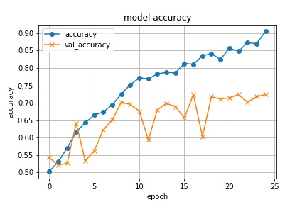
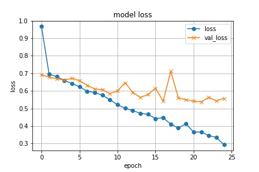

# 畳み込みニューラルネットワーク

## 実行環境
Python 3.7

### 追加パッケージ
* requests
* beautifulsoup4
* opencv-python
* numpy
* keras
* tensorflow
* matplotlib

## 説明
畳み込みニューラルネットワークを用いて犬と猫の画像を学習するプログラムです。
4つのソースコードを実行することで画像の取得、処理、判別を行います。

### scrape.py
google検索により犬と猫の画像を集めてきます。  
Originalフォルダにそれぞれ800枚程度保存されます。
### image_resizer.py
画像のサイズを変更します。  
Editedフォルダに250×250にリサイズされた画像が保存されます。
### image_sprit.py
画像をトレーニング用とテスト用に分割します。  
Trainフォルダにトレーニング用、Testフォルダにテスト用として保存されます。
### CNN.py
畳み込みニューラルネットワークを作成します。  
それから正解率と損失値をプロットしたグラフを表示します。
### ファイルの階層構造
~~~
.
├── scrape.py
├── image_resizer.py
├── image_sprit.py
├── CNN.py
├── Original
│    ├── dog
│    │    ├── 0.jpg
│    │    ├── 1.jpg
│    │    ︙
│    └── cat
│         ︙
├── Edited
│    ├── dog
│    │    ︙
│    └── cat
│         ︙
├── Train
│    ├── dog
│    │    ︙
│    └── cat
│         ︙
└── Test
     ├── dog
     │    ︙
     └── cat
          ︙
~~~

## 使い方
scrape.py、image_resizer.py、image_sprit.py、CNN.pyの順で実行してください。  
image_resizer.pyの実行後、Editedフォルダ内の関係ない写真は手作業で削除してください。  
CNN.pyの実行時間はかなり長くなります(40分程度)。
GoogleColaboratoryの無料GPU環境を使うことで大幅に時間短縮することができます(130秒程度)。
GoogleColaboratoryで実行する際はTrainフォルダとTestフォルダをアップロードしてください。  
[GoogleColaboratory](./ipynb/CNN.ipynb)

## 実行結果

  
トレーニングデータの学習は上手くできています。
損失値のグラフから10epochあたりから過学習の傾向があります。
結果的にテストデータを元にした正解率は72%ほどになりました。
